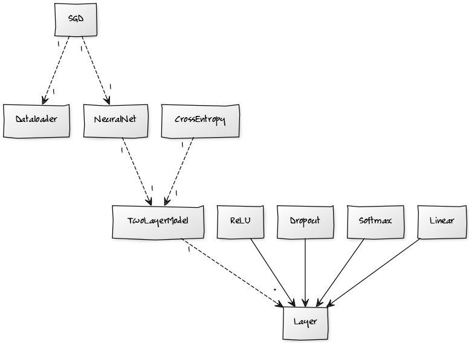
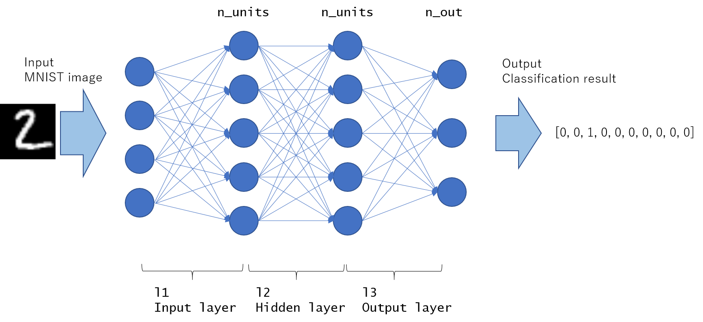

# Implementation

A more general Neural Network library, `Taivasnet` was implemented. It can be used for a lot more than just MNIST prediction.

However, as Numpy does not support GPU (Graphics Processing Unit), it's not feasible to train really complex models or huge data sets (working on CPU is really slow compared to GPU). If you want to train a larger model and a GPU, just use other libraries such as [PyTorch](https://pytorch.org/), [Keras](https://keras.io/) or [Tensorflow](https://www.tensorflow.org/).

Code is written in Python and is using [Numpy](http://www.numpy.org/) for matrix operations.

## Code architecture

### Modules

Code is divided into six different Python modules.

* [dataloaders.py](../taivasnet/taivasnet/dataloader.py) - contains classes for loading data, currently only one DataLoader is implemented, taivasnetDataLoader
* [models.py](../taivasnet/taivasnet/models.py) - contains models, which are basically object wrapping list of layers and a loss function
* [layers.py](../taivasnet/taivasnet/layers.py) - contains layers used in models
  * Layer - abstract class that all layers should inherit
  * Linear - Linear layer
  * Softmax - Softmax output layer
  * Dropout - Dropout regularization layer
  * ReLU - Rectified Linear Unit activation layer
* [losses.py](../taivasnet/taivasnet/losses.py) - contains loss functions
  * CrossEntropy - calculates Cross-Entropy loss
* [networks.py](../taivasnet/taivasnet/networks.py) - contains neural network implementations
  * NeuralNet - generic neural network that takes different models as input
* [optimizers.py](../taivasnet/taivasnet/optimizers.py) - contains different optimizers
  * SGD - Stochastic Gradient Descent with mini-batches optimizer

### Class diagram

This diagram gives an overview of how all the objects are connected to each other.

## Neural network model architecture

Neural network models are defined in [models.py](../taivasnet/taivasnet/models.py). The model that is currently used by [train.py](../taivasnet/train.py) is the only model currently defined, TwoLayerModel.

TwoLayerModel architecture is pretty simple.

*Image from http://corochann.com/mnist-training-with-multi-layer-perceptron-1149.html*

In TwoLayerModel case:

* Input layer has 784 (28x28 images flattened) units
* First hidden layer has 256 units
* Second hidden layer has 64 units
* Output layer has 10 units
* And what's missing from the image the output layer is connected to _Softmax_ layer which finally gives out 10 probabilities for different classes

However, by passing different attributes to the constructor you can easily change the number of units per layer.

Between the layers there are _Dropout_ layers for regularization and _ReLU_ layers for non-linearity.

Loss is calculated using [Cross-Entropy loss](https://en.wikipedia.org/wiki/Cross_entropy) that calculates the error between predicted probabilities and the actual label.

## How to improve

Using the predefined model with two hidden layers one can achieve around 97% accuracy on the MNIST test set.

Model is still quite fast overfitting (the training loss is lot lower than the validation cost). Currently only regularization that is used is `Dropout` layer. By adding another regularization method like [weight decay](https://www.quora.com/How-is-weight-decay-used-for-regularization-in-neural-networks) one should be able to reduce the overfitting a little bit and thus get better results.

Another technique that can be used for speeding up the training (you can use a larger learning rate) that also does some regularization is [Batch normalization](https://arxiv.org/pdf/1502.03167.pdf).

Last, but not least, the way to achieve human level accuracy is to add [Convolutional layers](https://en.wikipedia.org/wiki/Convolutional_neural_network) to the network.

